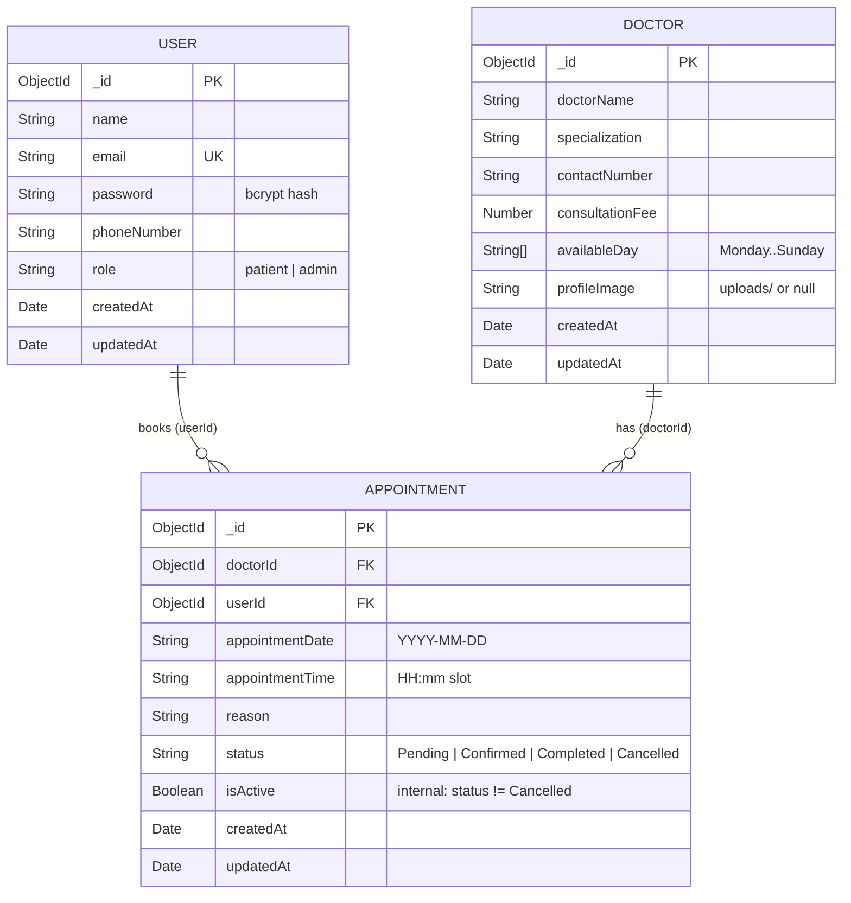

# Database Schema — Mobile Clinic Appointment Management System

MongoDB (Mongoose). Three collections: `users`, `doctors`, `appointments`.

## Relationships
- **Doctor 1 — N Appointment**: a doctor can have many appointments; each appointment belongs to exactly one doctor.
- **User 1 — N Appointment**: a patient can book many appointments; each appointment belongs to one patient.

## Constraints and indexes
| Collection | Constraint |
|------------|-----------|
| users | `name` 2–50 letters; `email` unique, lowercase, valid format; `password` stored as bcrypt hash (plain text must be 6–50 chars with a letter and a number); `phoneNumber` Sri Lankan format `0XXXXXXXXX` or `+94XXXXXXXXX`; `role` ∈ {patient, admin} |
| doctors | all fields except `profileImage` required; `doctorName` letters only; `specialization` 2–50 letters; `contactNumber` Sri Lankan format; `consultationFee` Rs. 0–100,000; `availableDay` has at least one valid weekday |
| appointments | `appointmentTime` ∈ clinic slots (09:00–16:30, 30 min); `reason` 5–500 characters; `status` default `Pending` |
| appointments | **Unique partial index** `{ doctorId, appointmentDate, appointmentTime }` where `isActive: true` — enforces "no double booking" at database level while allowing a cancelled slot to be rebooked |

## Why dates and times are strings
`appointmentDate` is a calendar day (`2026-09-25`) and `appointmentTime` a slot label (`10:00`). Storing them as strings avoids timezone shifts between the phone and the server and makes the double-booking check an exact match. `HH:mm` (24-hour) sorts correctly; the app displays it as `10:00 AM`.
