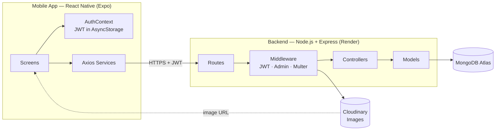

# System Architecture — Mobile Clinic Appointment Management System



## File Structure

```text
mobile-clinic-appointment-system/
├── backend/
│   ├── src/
│   │   ├── config/
│   │   │   └── db.js
│   │   ├── controllers/
│   │   │   ├── auth.controller.js
│   │   │   ├── doctor.controller.js
│   │   │   └── appointment.controller.js
│   │   ├── middleware/
│   │   │   ├── auth.middleware.js
│   │   │   ├── upload.middleware.js
│   │   │   └── error.middleware.js
│   │   ├── models/
│   │   │   ├── User.js
│   │   │   ├── Doctor.js
│   │   │   └── Appointment.js
│   │   ├── routes/
│   │   │   ├── auth.routes.js
│   │   │   ├── doctor.routes.js
│   │   │   └── appointment.routes.js
│   │   ├── utils/
│   │   │   ├── constants.js
│   │   │   └── validation.js
│   │   └── server.js
│   ├── seedAdmin.js
│   ├── seedDoctors.js
│   ├── .env.example
│   └── package.json
│
└── frontend/
    ├── src/
    │   ├── components/
    │   ├── constants/
    │   ├── context/
    │   │   └── AuthContext.js
    │   ├── navigation/
    │   │   ├── RootNavigator.js
    │   │   ├── AuthNavigator.js
    │   │   ├── PatientNavigator.js
    │   │   └── AdminNavigator.js
    │   ├── screens/
    │   │   ├── auth/
    │   │   ├── home/
    │   │   ├── doctors/
    │   │   ├── appointments/
    │   │   ├── admin/
    │   │   └── profile/
    │   ├── services/
    │   │   ├── api.js
    │   │   ├── authService.js
    │   │   ├── doctorService.js
    │   │   └── appointmentService.js
    │   └── utils/
    ├── App.js
    ├── app.json
    └── package.json
```
