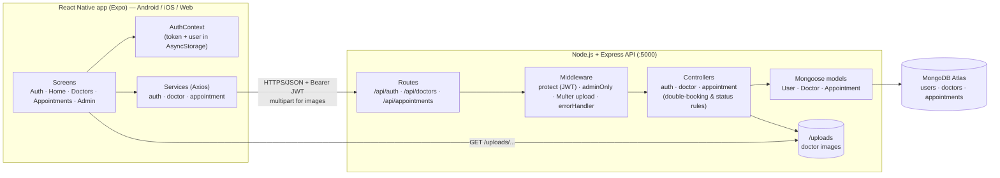

# System Architecture — Mobile Clinic Appointment Management System

## Request flow — booking an appointment
1. Patient picks a doctor → the app loads `GET /doctors/:id` and shows the doctor's next clinic days.
2. For the chosen date the app calls `GET /appointments/booked-slots` and greys out booked/past slots.
3. Patient submits `POST /appointments`.
4. `protect` verifies the JWT and loads the user; the controller checks: patient role, doctor exists, date valid and not past, weekday in `availableDay`, valid slot, no active appointment in that slot.
5. If the slot is taken → **409 "This time slot is already booked. Please select another time."** The unique partial index catches simultaneous requests too.
6. Otherwise the appointment is saved as **Pending** and returned with doctor details populated.
7. Admin later confirms → completes (or cancels) via `PATCH /appointments/:id/status`.

## Roles
| Role | Navigator | Can do |
|------|-----------|--------|
| patient | PatientNavigator (Home · Doctors · Appointments · Profile) | view doctors, book / reschedule / cancel own appointments |
| admin | AdminNavigator (Dashboard · Doctors · Appointments · Profile) | CRUD doctors + images, view all appointments, change status, delete records |
